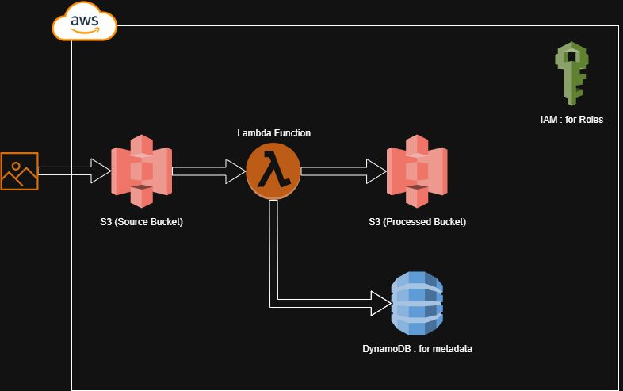

# Serverless Image Processor AWS (S3 & Lambda)

## Overview
This project implements a **serverless image processing pipeline** using AWS S3 and AWS Lambda.  
When a user uploads an image to the **source S3 bucket**, an `s3:ObjectCreated:*` event triggers a Lambda function that:

1. Resizes the image into multiple sizes .
2. Applies a watermark.
3. Stores the processed images in the **destination S3 bucket**.
4. Stores metadata in DynamoDB.

---

## Architecture


## AWS Resources 
- **Source bucket:** `imgproc-source`
- **Processed bucket:** `imgproc-processed`
- **Lambda function:** `ImageProcessor-Function`
- **DynamoDB table:** `ImageMetadata-Table`

---

**diagram**:
```mermaid
graph LR
  A[User] -->|Upload Image| S3Source(Source Bucket)
  S3Source -->|S3 Event| Lambda[Image Processor Lambda]
  Lambda --> S3Dest(Processed Bucket)
  Lambda -->|optional| DDB[DynamoDB Metadata Table]
  API[Optional API Gateway] --> S3Source

